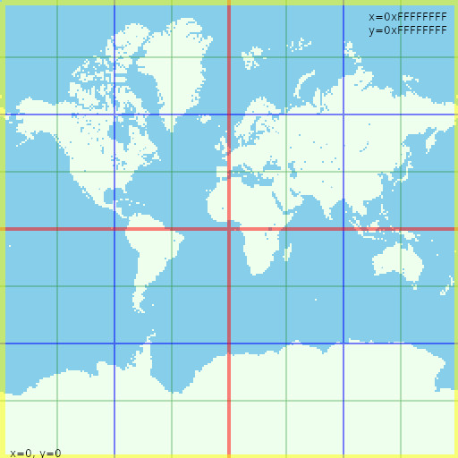

## From latitude and longitude to 32 bits unsigned integers
-180° to 180° longitude mapped to 0 0xFFFFFFFF (biggest unsigned 32 bits int) for internal program use.
## From two 32 bits unsigned integers to one 64 bits unsigned integers
latitude is mapped to unsigned 32 bit int using mercator projection.
0 being the most far south and 0xFFFFFFFF north.
    
    double angleRadians  =  angle * M_PI / 180.0;
     bool signe = false;
     if(angleRadians < 0) {
        angleRadians  = -1.0 * angleRadians;
        signe = true;
     }
    
    double dist = log(tan((angleRadians/2.0 + M_PI/4.0)));
    
    uint32_t normalized = 0;
    
    if(signe) normalized = 0b1000000000000000000000000000000  * (1 + dist/(2.5 * M_PI));
    else normalized =       0b1000000000000000000000000000000 * (1 - dist/(2.5 * M_PI));

## Dividing the world

world is divided in squares:
1 big part, then 4 smaller parts then 16 even smaller parts ... parts include lower x and y boudaries, not upper which are in the next part.
## Spatial objects indexing
to do
