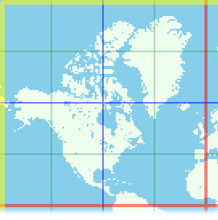

## From latitude and longitude to 32 bits unsigned integers
-180° to 180° longitude mapped to 0 0xFFFFFFFF (biggest unsigned 32 bits int) for internal program use.
 
latitude is mapped to unsigned 32 bit int using mercator projection.
0 being the most far south and 0xFFFFFFFF north.
    
    double angleRadians  =  angle * M_PI / 180.0;
     bool signe = false;
     if(angleRadians < 0) {
        angleRadians  = -1.0 * angleRadians;
        signe = true;
     }
    
    double dist = log(tan((angleRadians/2.0 + M_PI/4.0)));
    
    uint32_t normalized = 0;
    
    if(signe) normalized = 0b1000000000000000000000000000000  * (1 + dist/(2.5 * M_PI));
    else normalized =       0b1000000000000000000000000000000 * (1 - dist/(2.5 * M_PI));

## Dividing the world

world is divided in rectangles, we divide horizontally, then vertically:
1 big part, then 2 smaller parts then 4 even smaller parts and so on 64 times... parts include lower x and y boudaries, not upper which are in the next part.
## ordering the parts
As we want to use theses parts of map as an index, we have to order them. Let chose this way of ordering :

lets associate a number z to each (x,y) position, x an y being 32 bits unsigned integers,( most significant bit on the left )

if x is is in binary

x1 x2 x3 x4 x5 X6 x7 x8 x9 x10 x11  .... x32 each xn beeing 0 or 1

and y

y1 y2 y3 ..... y32

let our number be

z = x1 y1 x2 y2 x3 y3 .... x32 y32 making an unsigned 64 bits integer, x and y bits ar interleaved to make z.

the range  z1 z2 ... zn 0 0 0 0 ... 0 to z1 z2 ... zn 1 1 1 1 will represent a rectangle that we call geobox

let's call z1 z2 ... zn 0 ... 0 the position of the geobox

the number of bits varying from 0 to 1 the masklength of the geobox

we choose to order them this way

the "smaller" geobox is the one which the smaller z number , or the biggest masklength if z numbers  are equal.

we have divided the map in rectangles and ordered them :

as an example, the seven, biggest in size, geoboxes ordered from smaller to bigger according to this rule:

z = 0b00000000 00000000 000000000 00000000 00000000 00000000 000000000 00000000
masklength is 64

z = 0b00000000 00000000 000000000 00000000 00000000 00000000 000000000 00000000
masklength is 63

z = 0b00000000 00000000 000000000 00000000 00000000 00000000 000000000 00000000
masklength is 62

z = 0b01000000 00000000 000000000 00000000 00000000 00000000 000000000 00000000
masklength is 62

z = 0b10000000 00000000 000000000 00000000 00000000 00000000 000000000 00000000
masklength is 63

z = 0b10000000 00000000 000000000 00000000 00000000 00000000 000000000 00000000
masklength is 62

z = 0b11000000 00000000 000000000 00000000 00000000 00000000 000000000 00000000
masklength is 62

## interesting properties of this order
all geoboxes contained in one bigger geobox are in the range beginning with the this geobox and ending whith the geobox representing the point of ths geobox whith maximum x and maximum y. for instance, all geoboxes contained in geobox

geobox : { z =0b11101111 00000000 00000000 00000000 00000000 00000000 00000000 00000000, masklength = 56 }

are bigger than this geobox, and lesser or equal

geobox : { z = 0b11101111 11111111 11111111 11111111 11111111 11111111 11111111 11111111, masklength = 0 }

this will allow us to iterate geoboxes in an useful manner.

## In what geobox fits my item ?

( changing parts are in **bold** )

let boundaries of our item be in binary be :

x min  1 0 1 0 1 0 0 0 1 0 1 0 1 1 1 1 1 1 1 1 0 0 0 0 0 0 0 1 0 0 1 1 

y min   1 1 1 0 0 0 1 0 0 1 1 0 1 1 0 1 1 1 0 1 0 0 0 0 0 0 1 0 0 0 0 1

x max  1 0 1 0 1 0 0 0 1 0 1 0 1 1 1 1 1 1 1 1 0 0 0 0 0 0 **1 1 0 0 1 1**

y max   1 1 1 0 0 0 1 0 0 1 1 0 1 1 0 1 1 1 0 1 0 0 0 0 0 0 1 **1 0 0 0 1**

we compute z values, interleaving bits :

z min  11011100 10000100 100111001 11110111 11110110 00000000 00001100 00010110

z max  11011100 10000100 10011100 111110111 11110110 00000000 000**11110 00010110**

the 51 first bits of z are unchanged, the first changing bit is the 52th. our item fits in gebox

geobox : { z = 0b 11011100 10000100 10011100 11111011 11111011 00000000 000**00000 00000000**, masklength = 13 }

## In this case geobox is much bigger than my item

if our item was right in the middle of the map, he would fit only in the biggest geobox because the most left bit of z min and z max would be different, even if the size of the item is small.

geobox : { z = 0b 1**000000 00000000 00000000 000000000 000000000 00000000 000000000 00000000**, masklength = 63 }

that's a big problem as we would like to index it in something that matches well it's position and size !

## Cutting my item in pieces to index it

let an item be like tis picture :

if we cut it on the green and red lines, we see that he will fit in geoboxes that match much more his size, thats how we will index items, cutting them in four, selecting the four geoboxes where the part fit. and merging those geoboxes when one is included in another one.

